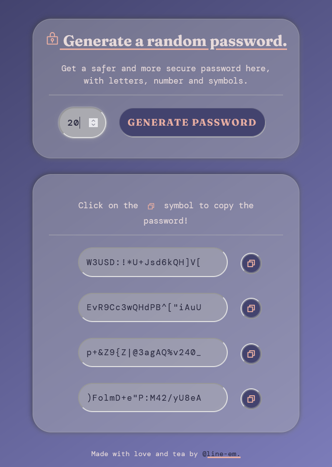

# Password Generator

Project made for Scrimba Solo Challenge. 🎉
You can generate passwords of any length, combining letters (lowercase and uppercase), numbers and symbols. **You can also copy them!**

Note: As of the moment, the Copy button is not working on Opera.

## Overview

This project was made with vanilla HTML, JS and CSS. It is responsive, but if you find out any problems with it, feel free to reach out to me and I will fix it!

## To-do

- Polish CSS
- Add a checkbox to customize the passwords, with letters/numbers/symbols.

## Changelog

- 1.0 - Initial commit.
- 1.1 - Testing on different browsers.
